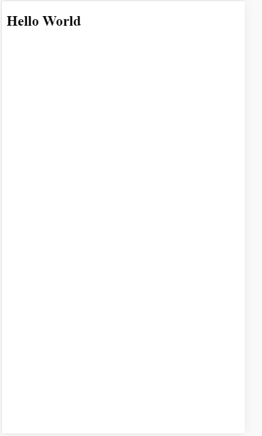
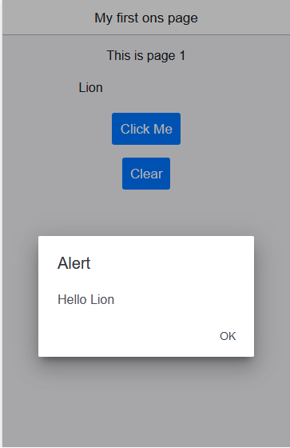
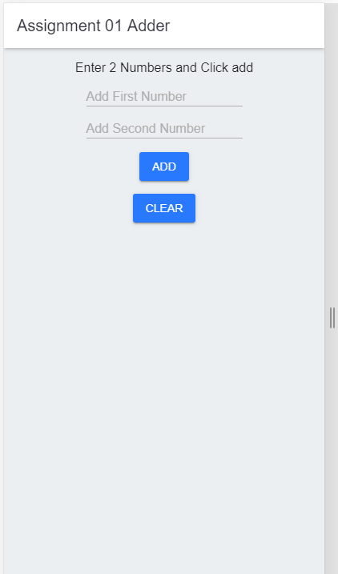

# Android Mobile App Development with Onsen UI and Phonegap #

1. Download: https://phonegap.com/getstarted/ and download exe or npm install -g phonegap

and install it

2. Download https://onsen.io/v2/guide/#getting-started and unzip file and move that same location where is your
phone project. Copy js and ccs folders in you www folder.

3. Downoload https://jquery.com/ and copy https://code.jquery.com/jquery-3.4.1.min.js your phone project www folder.

## Hello world application ##

## 1 page application ##

## Assignment 01 - Adder ##

